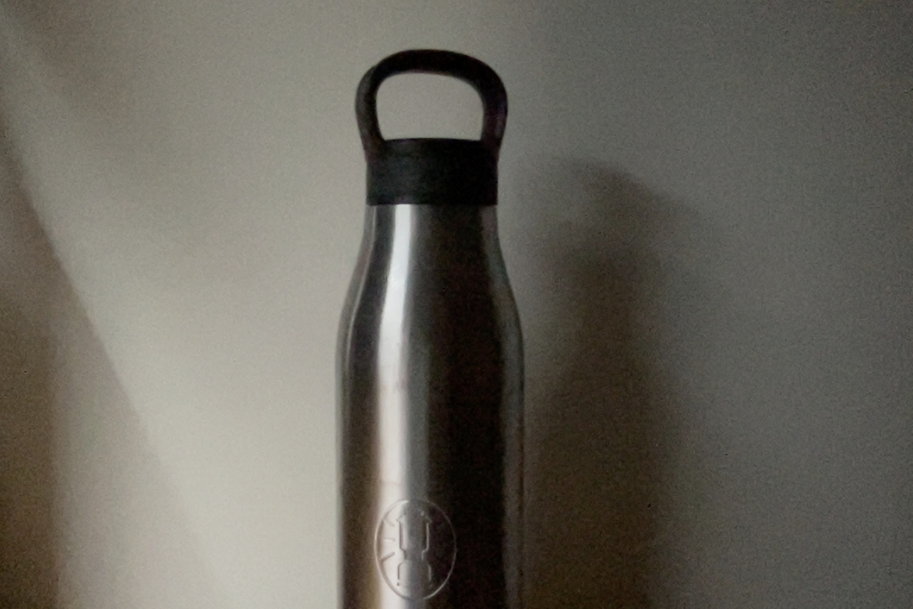
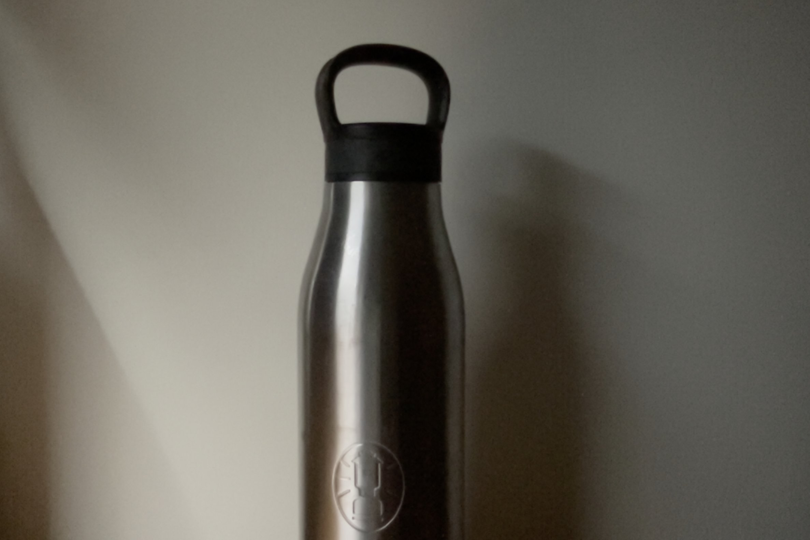
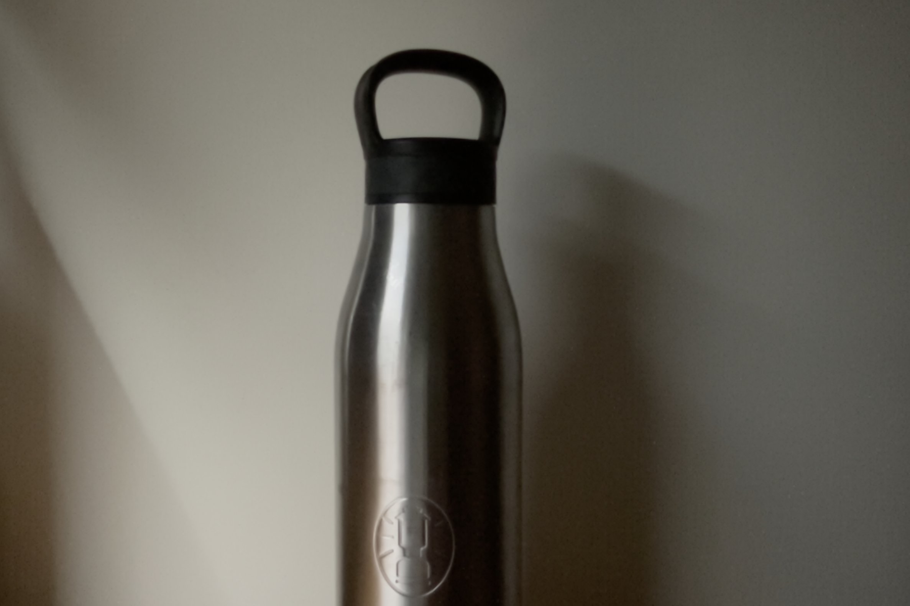
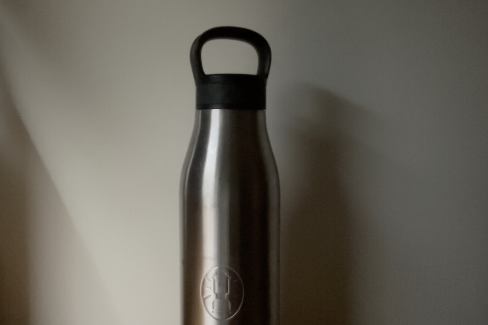

# DIP 影像處理作業 1

本專案透過多張同一場景的 JPEG 影像進行像素值相加取平均與中位數計算，以去除影像中的隨機噪點。

## 目錄結構
```
hw1/
├─ img/                 // 存放輸入測試的 JPEG 檔案
├─ include/
│  ├─ jpeg_reader.h
│  └─ save_ppm.h
├─ src/
│  ├─ avg.cpp           // 平均值合併（去噪）
│  ├─ median.cpp        // 中位數合併（去噪）
│  ├─ jpeg_reader.cpp   // JPEG 讀取實作
│  └─ save_ppm.cpp      // PPM 輸出實作
├─ output/              // 存放結果 PPM 檔案
├─ build_avg.sh         // 編譯 avg
├─ build_median.sh      // 編譯 median
└─ ppm_to_jpg.py        // 將 ppm 檔轉成 jpg 檔
```  

## 相依性

- C++11  
- libjpeg  
- POSIX (mkdir)

## 快速開始

1. 進入專案資料夾

```
cd hw1
```

2. 建置平均值合併執行檔:

```
./build_avg.sh
```

3. 建置中位數合併執行檔:

```
./build_median.sh
```

4. 執行程式，傳入一個整數（代表要處理的圖片數量），圖片檔案固定放在 `img/img1.jpg`, `img/img2.jpg` … `img/imgN.jpg`：
```bash
# 平均值去噪
./avg <image_count>
# 或中位數去噪
./median <image_count>
```  

5. 結果會輸出至 `output/` 資料夾，檔名格式：

- **平均值：** `output/avg_result_<N>.ppm`  
- **中位數：** `output/median_result_<N>.ppm`  

其中 `<N>` 為實際處理的圖片數量。

## 主要程式檔案

- **avg.cpp**  
  平均值合併：讀取所有 JPEG，累加各像素值後除以張數，四捨五入後限縮至 `[0,255]`，輸出 PPM。

- **median.cpp**  
  中位數合併：為每個像素位置蒐集所有影像值，排序後取中位（偶數時取右側），輸出 PPM。

- **jpeg_reader.cpp / jpeg_reader.h**  
  使用 libjpeg 解碼 JPEG，回傳原始的 RGB(A) 資料。

- **save_ppm.cpp / save_ppm.h**  
  將原始緩衝輸出成 PPM (P3 ASCII) 格式檔案。

## 範例

### 平均值合併

```bash
# 若 img 資料夾中有 3 張 JPEG： img/1.jpg, img/2.jpg, img/3.jpg
./avg 3
# 完成！結果存入 output/avg_result_3.ppm
```

### 中位數合併

```bash
# 若 img 資料夾中有 5 張 JPEG： img/1.jpg … img/5.jpg
./median 5
# 完成！結果存入 output/median_result_5.ppm
```

## 結果

以下展示部分輸入與輸出圖片（請確保檔案路徑正確）：

### 輸入範例  


### 平均值去噪結果  



### 中位數去噪結果  

