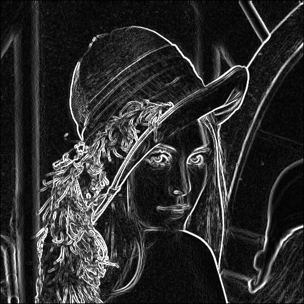
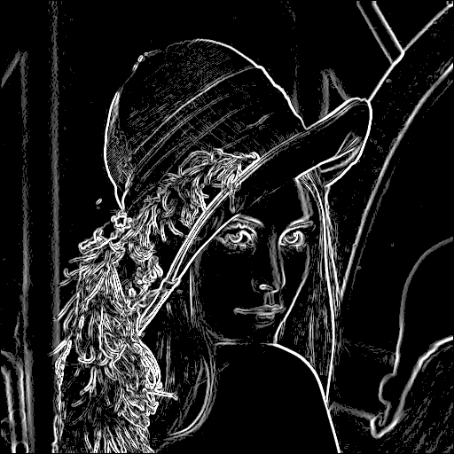
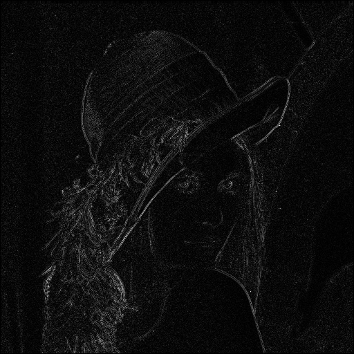
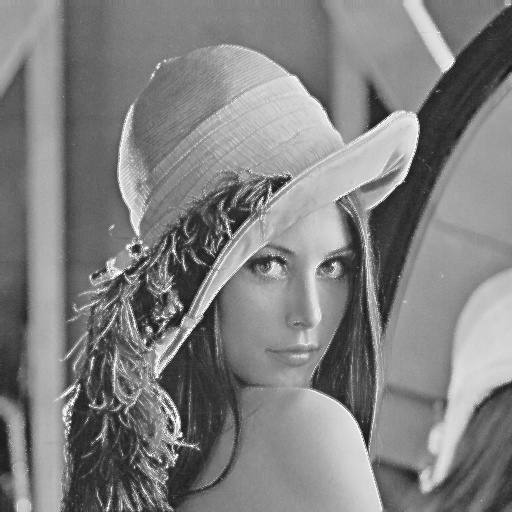

# 影像處理作業 3

學號：7113056083

姓名：楊啟弘


## 作業要求

### `一階`微分邊緣偵測、權重圖

**目標**  
- 產生可作為權重圖的一階邊緣圖，並正規化成 [0.0, 1.0]。

**步驟**

1. 對灰階影像使用 Sobel 算子，得到「一階邊緣圖」`edge1`。 

2. 對 `edge1` 進行 高斯模糊，，得到一張較為平滑的邊緣響應 `smooth1`。

3. 把 `smooth1` 做 最小–最大正規化：把像素值映射到 [0.0, 1.0]。

**輸出**  
- 權重圖 `weight.png`

---

### `二階`微分邊緣與銳化
**目標**
- 生成二階邊緣圖`edge2`，並產生二階銳化圖 `sharp2`。

**步驟**
1.	使用 Laplacian，得到二階邊緣圖 `edge2`。
2.	銳化合成：將 edge2 直接加回原圖，得到二階微分銳化圖 `sharp2`。

**輸出**
- 二階邊緣圖 `edge2.png`（僅含邊緣線條強度）
- 二階銳化圖 `sharp2.jpg`（原圖＋edge2 合成）

---

### Result A 

- 將二階微分**銳化圖**`sharp2` 乘上一階邊緣權重圖 `weight.png`，加回原圖，輸出 `resultA`。

---

### Result B 
- 將二階微分**邊緣圖** `edge2` 乘上一階邊緣權重圖 `weight.png`，加回原圖，輸出 `resultB`。

---

### Super Resolution

**目標**  
- 使用 Real-ESRGAN 模型對原圖進行超解析度放大，生成高解析度影像 `superres.png`。

**步驟**  
1. 安裝 Real-ESRGAN 相關環境與預訓練權重。  
2. 讀取原始彩色影像並前處理（正規化、必要時切塊）。  
3. 將影像餵入 Real-ESRGAN，進行推論，得到超解析度輸出。  
4. 後處理（反正규化、合併切塊、可選去噪／色彩校正）。  
5. 儲存 `superres.png`。

**輸出**  
- 超解析度影像 `superres.png`

## 檔案說明

| 名稱                      | 說明                                           |
| ------------------------- | ---------------------------------------------- |
| `GAN/Real-ESRGAN/`        | 存放 Real-ESRGAN 超解析度模型與權重             |
| `input/`                  | 原始待處理影像                                  |
| `output/`                 | 處理後影像（edge1, smooth1, weight, edge2, sharp2, resultA, resultB, superres） |
| `apply_weight_sharpenA.py`| 用一階權重從 `sharp2.png` 擷取局部細節並生成 `resultA.png` |
| `apply_weight_sharpenB.py`| 用一階權重與 `edge2.png` 生成純輪廓強化 `resultB.png` |
| `gaussian.py`             | 對影像做 Gaussian 模糊，輸出 `smooth1.png`      |
| `laplacian_add.py`        | 將 `edge2.png` 加回原圖，生成銳化影像 `sharp2.png` |
| `laplacian.py`            | 計算並正規化二階邊緣，輸出 `edge2.png`          |
| `normalize_edge.py`       | 正規化 `smooth1.png` 為 `weight.png`（0–1 權重） |
| `sobel.py`                | 計算一階邊緣並輸出 `edge1.png`（未正規化）      |
| `requirements.txt`        | 列出所需 Python 套件                            |

## 程式碼說明

### sobel.py

```python
# Sobel 卷積核
Gx = [
    [-1, 0, 1],
    [-2, 0, 2],
    [-1, 0, 1]
]
Gy = [
    [ 1,  2,  1],
    [ 0,  0,  0],
    [-1, -2, -1]
]

def sobel_edge_detection(pixels, w, h, maxval=255):
    out = [[0]*w for _ in range(h)]
    pad = 1

    for y in range(pad, h-pad):
        for x in range(pad, w-pad):
            gx = 0
            gy = 0
            # 同時計算水平/垂直梯度
            for dy in range(-pad, pad+1):
                for dx in range(-pad, pad+1):
                    weight_x = Gx[dy+pad][dx+pad]
                    weight_y = Gy[dy+pad][dx+pad]
                    val = pixels[y+dy][x+dx]
                    gx += weight_x * val
                    gy += weight_y * val

            # 合併梯度為邊緣強度
            magnitude = int(min(maxval, (gx*gx + gy*gy)**0.5))
            out[y][x] = magnitude

    return out

```
⸻

### gaussian.py


```python
def make_gaussian_kernel(ksize, sigma):
    half = ksize // 2
    kernel = [[0.0]*ksize for _ in range(ksize)]
    sum_val = 0.0

    for i in range(ksize):
        for j in range(ksize):
            x = i - half
            y = j - half
            g = math.exp(-(x*x + y*y) / (2*sigma*sigma))
            kernel[i][j] = g
            sum_val += g

    # 正規化使總和＝1
    for i in range(ksize):
        for j in range(ksize):
            kernel[i][j] /= sum_val

    return kernel

def gaussian_blur(pixels, w, h, ksize, sigma):
    kernel = make_gaussian_kernel(ksize, sigma)
    pad = ksize // 2
    out = [[0]*w for _ in range(h)]

    for y in range(pad, h-pad):
        for x in range(pad, w-pad):
            acc = 0.0
            for dy in range(-pad, pad+1):
                for dx in range(-pad, pad+1):
                    weight = kernel[dy+pad][dx+pad]
                    val = pixels[y+dy][x+dx]
                    acc += weight * val
            out[y][x] = int(acc + 0.5)

    return out
```
⸻

### laplacian.py


```python
# 3×3 四鄰域 Laplacian 卷積核
LAPLACIAN_KERNEL = [
    [0,  1,  0],
    [1, -4,  1],
    [0,  1,  0]
]

def laplacian_edge_detection(pixels, w, h, maxval=255):
    out = [[0]*w for _ in range(h)]
    pad = 1

    for y in range(pad, h-pad):
        for x in range(pad, w-pad):
            s = 0
            for dy in range(-pad, pad+1):
                for dx in range(-pad, pad+1):
                    weight = LAPLACIAN_KERNEL[dy+pad][dx+pad]
                    s += weight * pixels[y+dy][x+dx]
            val = abs(s)
            out[y][x] = min(maxval, val)

    return out

def normalize_to_255(edges, w, h):
    M = max(max(row) for row in edges)
    if M == 0:
        return edges
    for y in range(h):
        for x in range(w):
            edges[y][x] = int(edges[y][x] / M * 255)
    return edges

```
⸻

### laplacian_add.py

```python
def laplacian_add_color(orig, edge2, w, h):
    orig_pix = orig.load()
    edge_pix = edge2.load()
    result = Image.new('RGB', (w, h))
    res_pix = result.load()

    for y in range(h):
        for x in range(w):
            e = edge_pix[x, y]      # 二階邊緣值 0–255
            r0, g0, b0 = orig_pix[x, y]
            # 將 e 加回三通道並 clamp
            r = min(255, max(0, r0 + e))
            g = min(255, max(0, g0 + e))
            b = min(255, max(0, b0 + e))
            res_pix[x, y] = (r, g, b)

    return result

```

- edge2 是灰階二階邊緣圖，直接把它加到原圖每個通道，並限制在 0–255。

⸻

### normalize_edge.py

```python
def normalize_edge_map(input_path, output_path=None):
    img = Image.open(input_path).convert('L')
    w, h = img.size
    pix = img.load()

    # 找最小值與最大值
    minv, maxv = 255, 0
    for y in range(h):
        for x in range(w):
            v = pix[x, y]
            if v < minv: minv = v
            if v > maxv: maxv = v

    denom = maxv - minv
    weight_map = [[0.0]*w for _ in range(h)]
    if denom == 0:
        if output_path:
            Image.new('L', (w, h)).save(output_path)
        return weight_map

    if output_path:
        out_img = Image.new('L', (w, h))
        out_pix = out_img.load()

    for y in range(h):
        for x in range(w):
            v = pix[x, y]
            norm = (v - minv) / denom  # 0.0–1.0
            weight_map[y][x] = norm
            if output_path:
                out_pix[x, y] = int(norm * 255 + 0.5)

    if output_path:
        out_img.save(output_path, 'PNG')
    return weight_map

```
⸻

### apply_weight_sharpenA.py


```python
def apply_weight_fusion(orig, sharp, wmap, beta):
    w, h = orig.size
    orig_pix = orig.load()
    sharp_pix = sharp.load()
    wmap_pix = wmap.load()
    result = Image.new('RGB', (w, h))
    res_pix = result.load()

    for y in range(h):
        for x in range(w):
            w_val = wmap_pix[x, y] / 255.0    # 0.0–1.0
            r0, g0, b0 = orig_pix[x, y]
            r1, g1, b1 = sharp_pix[x, y]
            # fusion = w * sharp2
            fr = int(r1 * w_val)
            fg = int(g1 * w_val)
            fb = int(b1 * w_val)
            # 加回原圖並乘 β
            r = min(255, max(0, int(r0 + beta * fr)))
            g = min(255, max(0, int(g0 + beta * fg)))
            b = min(255, max(0, int(b0 + beta * fb)))
            res_pix[x, y] = (r, g, b)

    return result

```

⸻

### apply_weight_sharpenB.py

```python
def apply_resultB(orig, edge2, weight, gamma):
    w, h = orig.size
    orig_pix = orig.load()
    edge_pix = edge2.load()
    weight_pix = weight.load()
    result = Image.new('RGB', (w, h))
    res_pix = result.load()

    for y in range(h):
        for x in range(w):
            w_val = weight_pix[x, y] / 255.0  # 0.0–1.0
            e_val = edge_pix[x, y]           # 0–255
            delta = int(gamma * w_val * e_val)
            r0, g0, b0 = orig_pix[x, y]
            # 加回原圖
            r = min(255, max(0, r0 + delta))
            g = min(255, max(0, g0 + delta))
            b = min(255, max(0, b0 + delta))
            res_pix[x, y] = (r, g, b)

    return result

```
⸻

## 結果

### img.png：原圖


### edge1.png：一階邊緣圖


### smooth1.png：平滑後的一階邊緣圖


### weight.png：一階邊緣權重圖


### edge2.png：二階邊緣圖


### sharp2.png：二階銳化圖


### resultA.png：ResultA（區域化銳化影像）


### resultB.png：ResultB（純輪廓強化影像）


### superres.png：超解析度圖


## 評估

### ResultA：
邊緣與細節同時被放大，輪廓更立體飽滿，但背景維持原樣，看起來鮮明又自然。

### ResultB：
雖然肉眼上觀察，與 Result A 差別不大，但在流程上的差異以及理論上，差別在於強化輪廓線條，邊緣明亮銳利，背景與平坦區不受影響，突顯物體輪廓。

### Super Resolution：
影像被放大後仍保有豐富細節，邊緣不易鋸齒，畫質明顯提升。與上述兩者差異在於是像素大小上的提升，並非強化邊緣線條，甚至因為是 AI 所產生，所以有準確率問題，因此可能會產出錯誤的畫面，並且肉眼上觀察會稍微有點不真實感。

## 討論

此次作業讓我了解到如何實際幫影像強化邊緣，以及每種做法的好壞等，也了解到 AI 對於影像處理上的強大之處，同時也了解到有很多空間可以去進步。