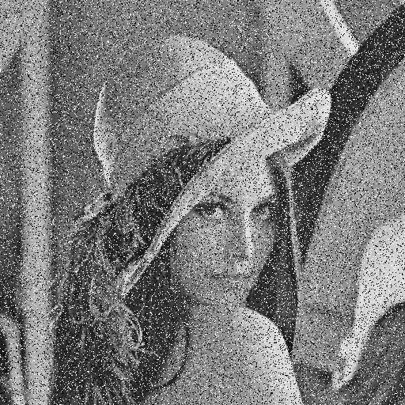
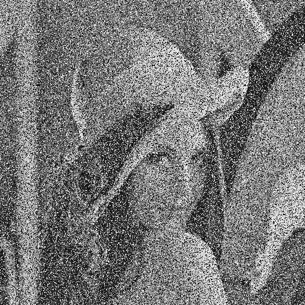

# 影像處理作業 4

學號：7113056083

姓名：楊啟弘

## 作業要求

比較傳統中值濾波（Median Filter, **MF**）與自適應中值濾波（Adaptive Median Filter, **AMF**）在不同椒鹽雜訊強度下之去噪效果與細節保留能力。

### 輸入影像
- 單通道 8-bit 灰階影像

### 雜訊類型
- 鹽與胡椒雜訊（Salt-and-Pepper Noise）

### 實驗條件
1. **雜訊比例**
   - 低雜訊組：P(0) = P(255) = 0.1  
   - 高雜訊組：P(0) = P(255) = 0.25  

2. **濾波演算法**
   - **傳統中值濾波（MF）**  
     - 低雜訊組：固定視窗大小 3×3  
     - 高雜訊組：固定視窗大小 7×7  
   - **自適應中值濾波（AMF）**  
     - 初始視窗大小：3×3  
     - 最大視窗大小：動態擴展至 15×15

> 在主要演算法(MF、AMF)中不可使用套件

## 檔案說明

| 檔案/資料夾               | 說明                                           |
|---------------------------|------------------------------------------------|
| **input/**                | 原始輸入影像                                    |
| &emsp;img.png             | 原始灰階影像                                    |
| **output/**               | 存放加入雜訊與濾波後的影像                      |
| &emsp;noisy_low.png       | 低雜訊 (P₀=P₂₅₅=0.1) 輸入影像                   |
| &emsp;MF_low.png          | 低雜訊組經 3×3 中值濾波 (MF) 後影像             |
| &emsp;AMF_low.png         | 低雜訊組經自適應中值濾波 (AMF) 後影像           |
| &emsp;noisy_high.png      | 高雜訊 (P₀=P₂₅₅=0.25) 輸入影像                  |
| &emsp;MF_high.png         | 高雜訊組經 7×7 中值濾波 (MF) 後影像             |
| &emsp;AMF_high.png        | 高雜訊組經自適應中值濾波 (AMF) 後影像           |
| adaptive_median_filter.py | 自適應中值濾波 (AMF) 實作                       |
| median_filter.py          | 手動實作固定視窗中值濾波 (MF)                   |
| salt_and_pepper.py        | 在影像中加入鹽與胡椒雜訊                        |
| requirements.txt          | 專案相依套件列表                                |

## 程式碼

### Median Filter

```Python
# 逐像素、逐通道計算中值
for y in range(H):
    for x in range(W):
        for c in range(C):
            # 取出 ksize×ksize 視窗並攤平成一維陣列
            window = padded[y : y+ksize, x : x+ksize, c].ravel()
            # 排序後取中位數，並寫入輸出影像
            out[y, x, c] = np.median(window)
```
說明：
1. 外層兩層迴圈依序遍歷影像每個像素座標 (y, x)。
2.	內層迴圈對每個通道 c（灰階圖僅有一個通道）取出當前視窗大小 ksize×ksize 的像素值，並攤平成一維陣列。
3.	利用 np.median 直接計算中位數，將結果寫入輸出影像對應位置。

### Adaptive Median Filter

```python
for i in range(rows):
    for j in range(cols):
        window_size = 3  # 起始視窗大小 3×3
        while True:
            half = window_size // 2
            # 取出當前視窗
            local = padded[i : i + window_size, j : j + window_size]
            # 計算最小值、中值、最大值
            z_min = local.min()
            z_med = np.median(local)
            z_max = local.max()
            # 當前中心像素
            z_xy  = padded[i + half, j + half]

            # Level A: 中值可靠性檢查
            if z_min < z_med < z_max:
                # Level B: 若中心像素為噪點（等於中值），則以中值替換
                output[i, j] = z_med if z_xy != z_med else z_xy
                break
            else:
                # 擴大視窗
                window_size += 2
                # 超過最大視窗，強制以中值替換
                if window_size > s_max:
                    output[i, j] = z_med
                    break
```

說明：
1.	雙層迴圈 (i,j) 遍歷影像每個像素。
2.	動態視窗：從 3×3 開始，每次 +2，最多擴到 s_max×s_max。
3.	Level A：檢查區域中值是否位於最小／最大值之間，判定「中值可靠」。
4.	Level B：若中心像素非中值，則以中值取代；否則保留原值。
5.	終止條件：一旦通過 Level A／B 或超出最大視窗，就結束當前像素的處理。

## 結果

### 原圖


### 低雜訊圖 (P₀=P₂₅₅=0.1)

| 原圖                          | MF 3×3                         | AMF                             |
|-------------------------------|--------------------------------|---------------------------------|
|  |  |  |

---

### 高雜訊圖 (P₀=P₂₅₅=0.25)

| 原圖                          | MF 7×7                         | AMF                             |
|-------------------------------|--------------------------------|---------------------------------|
|  |  |  |

## 評估（主觀感受）

### 低雜訊圖 (P₀=P₂₅₅=0.1)

1. MF（3×3 中值濾波）
- 噪點殘留：可見少量白點與黑點。
- 細節銳利度：跟原圖相比之下，有變模糊。

2. AMF
- 噪點殘留：完全看不到椒鹽噪點。
- 細節銳利度：雖然在肉眼下，與 MF 看起來差不多，但根據紀錄總共使用各個視窗大小的次數（如下）

    | 視窗大小 | 使用次數    |
    |---------|------------|
    | 3×3     | 260,829 次 |
    | 5×5     |   1,306 次 |
    | 7×7     |       9 次 |

    可以發現有使用到更大的視窗，因此有部分會是比 MF 來得模糊，但也完全清除了躁點。

### 高雜訊圖 (P₀=P₂₅₅=0.25)

1. MF（7×7 中值濾波）
- 噪點殘留：完全看不到椒鹽噪點。
- 細節銳利度：跟原圖相比之下，變得很明顯得模糊。

2. AMF
- 噪點殘留：完全看不到椒鹽噪點。
- 細節銳利度：

    | 視窗大小 | 使用次數    |
    |---------|------------|
    | 3×3     | 251,573 次 |
    | 5×5     |  1,0421 次 |
    | 7×7     |     150 次 |

    與 MF 相比之下，肉眼明顯得有比較清楚，同時與低雜訊度的AMF相比，也可以發現使用大視窗的次數也增加。

### 結論

在低、高雜訊度的實驗結果中，實際可以看出，AMF既可以消除雜訊、同時也確保有一定的細節。

## 討論

在實驗過程中有發現，使用png檔以及jpg檔的差異，假如是使用jpg檔，在AMF的結果就會非常糟糕，在同樣參數的情況下，會殘留出非常多躁點，效果甚至比MF還差。研究後發現似乎是因為jpg為壓縮失真的關係AMF/MF 在計算中值時，可能誤把這些 Artefact 當作「噪點」處理，或遺留不必要的殘影。
