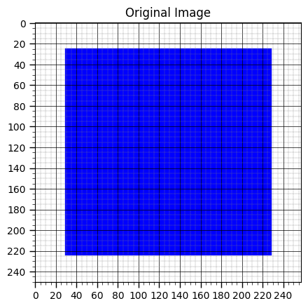
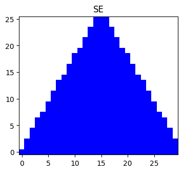
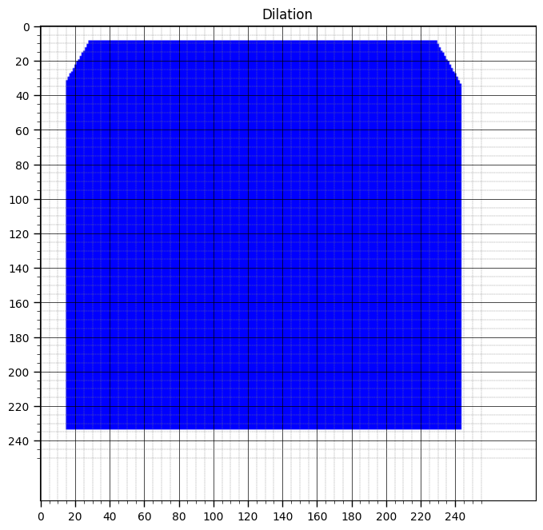
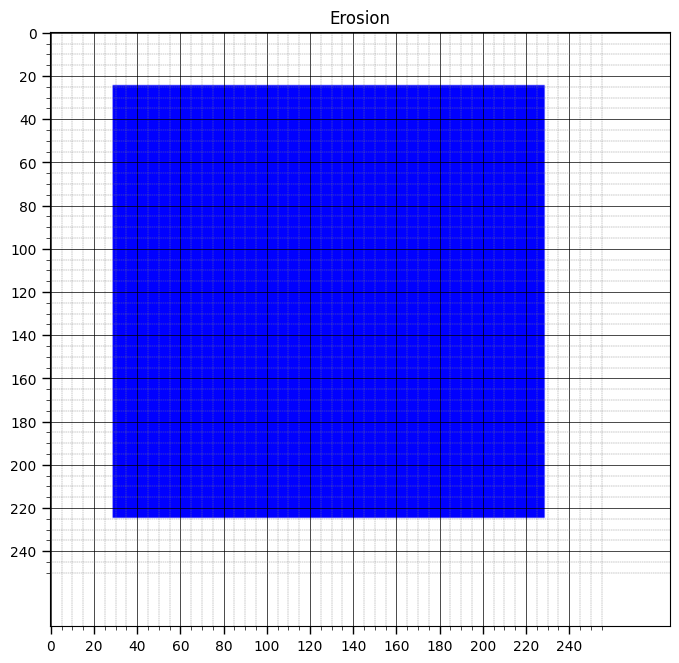

# 影像處理作業 5
學號：7113056083

姓名：楊啟弘

## 作業要求

1. 實作出 Dilation & Erosion
2. 前景圖：200*200 px 矩形
3. SE: 30 px 正三角形（Anchor 為重心）

## 主要程式碼（Dilation & Erosion）

### Dilation

```Python
def dilation_binary(img, se, anchor):
    H, W = img.shape
    h, w = se.shape
    ax, ay = anchor
    out_H, out_W = H + h - 1, W + w - 1
    out = np.zeros((out_H, out_W), dtype=np.uint8)

    for i in range(out_H):
        for j in range(out_W):
            hit = False
            for u in range(h):
                for v in range(w):
                    if se[u, v] == 0:
                        continue
                    x = i - ax + u
                    y = j - ay + v
                    if 0<=x<H and 0<=y<W and img[x,y]==1:
                        hit = True
                        break
                if hit:
                    break
            out[i, j] = 1 if hit else 0
    return out
```

### Erosion

```Python
def erosion_binary(img: np.ndarray,
                   se: np.ndarray,
                   anchor: tuple[int,int]) -> np.ndarray:

    H, W = img.shape
    h, w = se.shape
    ax, ay = anchor

    # 1. 反射 SE 並計算新的錨點
    se_ref = np.flipud(np.fliplr(se))
    ax_ref = h - 1 - ax
    ay_ref = w - 1 - ay

    # 2. 對原圖做 zero‐padding，使得輸出可以對應到所有 (i,j)
    pad_top    = ax_ref
    pad_bottom = h - 1 - ax_ref
    pad_left   = ay_ref
    pad_right  = w - 1 - ay_ref
    img_pad = np.pad(img,
                     ((pad_top, pad_bottom),
                      (pad_left, pad_right)),
                     mode='constant',
                     constant_values=0)

    # 3. 初始化輸出
    out = np.zeros((H, W), dtype=np.uint8)

    # 4. 迴圈掃描每個輸出像素
    for i in range(H):
        for j in range(W):
            match = True

            for u in range(h):
                for v in range(w):
                    if se_ref[u, v] == 0:
                        continue
                    if img_pad[i + u, j + v] == 0:
                        match = False
                        break
                if not match:
                    break
            out[i, j] = 1 if match else 0

    return out
```

## 結果展示

### 前景圖



此矩形的四個角落座標為：
- 左上角：(30, 30)
- 右上角：(230, 30)
- 左下角：(30, 230)
- 右下角：(230, 230)

因此可得知邊長皆為 200px。

### Structuring Element



可從底部得知邊長為 30px，並且經由計算可得知斜邊也約 30px。

### Dilation



底部的邊角分別為(15, 237.5), (245, 237.5)

因此可得知有經由 SE 膨脹過後，使前景圖放大。

### Erosion



此矩形的四個角落座標大約為：
- 左上角：(30, 30)
- 右上角：(230, 30)
- 左下角：(30, 230)
- 右下角：(230, 230)

因此可得知邊長皆為 200px，此200*200矩形經由正三角形的SE給膨脹、侵蝕過後，會恢復原狀。

## 討論

經由這次作業，讓我更了解膨脹侵蝕的演算法，也得知為何SE需要經過反射。

